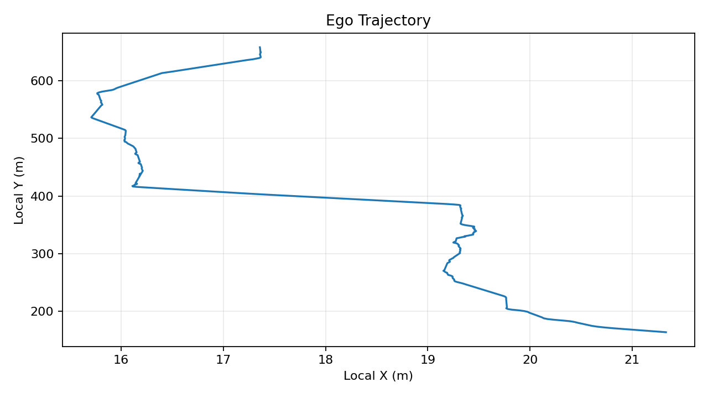
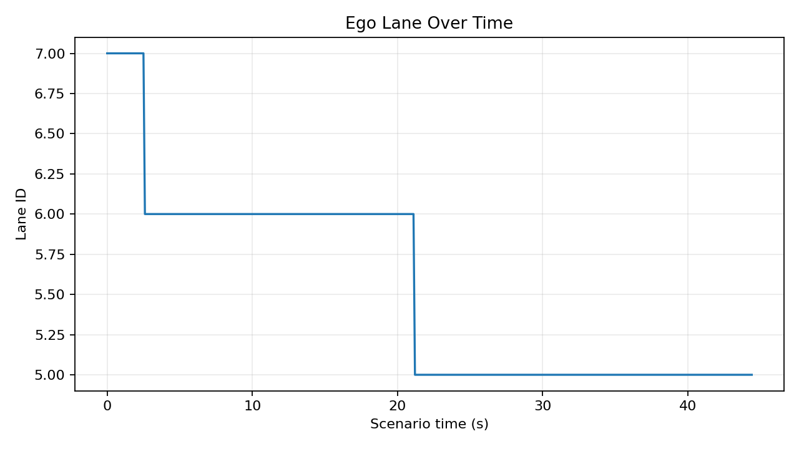
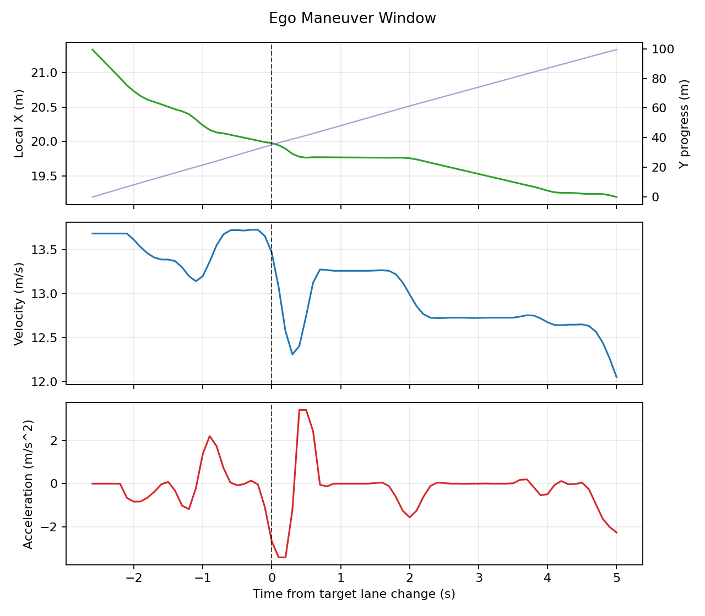
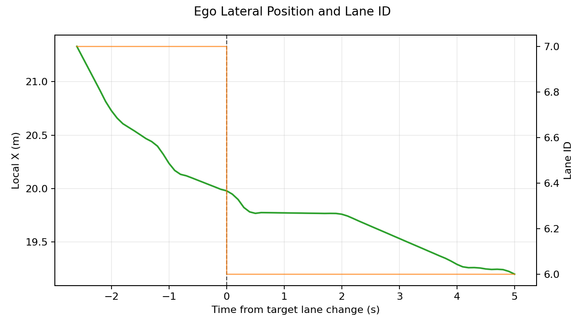
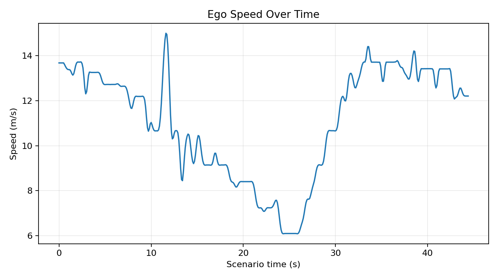
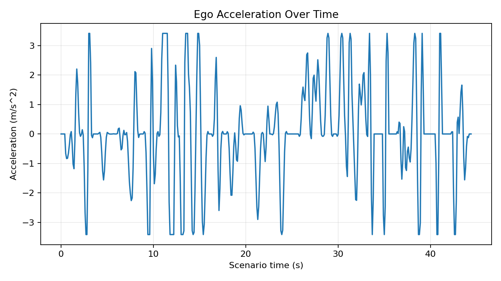

# NGSIM Ego-Vehicle Extraction: Decisions, Progress, and Examples

## Executive Decisions

- Use the official DOT/FHWA US-101 dataset instead of the partial Kaggle mirror.
  - The Kaggle package only included `7:50 AM - 8:05 AM`.
  - The official package provides all three US-101 segments: `7:50-8:05`, `8:05-8:20`, and `8:20-8:35`.

- Focus on lane-change maneuver scenarios rather than generic straight-driving ego vehicles.
  - Candidate extraction now prioritizes target lane-change events.
  - Current export contains `30` lane-change-event scenarios.

- Use a 500 m road-window crop for scenario recreation.
  - Scenarios are selected around a target lane-change event while preserving roughly 500 m of ego trajectory context.

- Apply the leader-free rule only during the target maneuver window.
  - Rule: `Preceding == 0 OR Space_Headway_m > 75 m`.
  - This is checked from `5 seconds before` to `5 seconds after` the target lane-change frame.
  - Outside the maneuver window, preceding vehicles are allowed.

- Keep middle/freeway lanes configurable.
  - Current middle-lane set: `[2, 3, 4, 5, 6, 7]`.
  - Lane 8 is excluded by default.

- Export both full and compact surrounding-vehicle context.
  - `surrounding_vehicles_full.csv`: broad context around ego.
  - `surrounding_vehicles.csv`: compact simulator-ready context.
  - Compact rule keeps closest ahead/behind vehicles per nearby lane, with a `30 m behind / 60 m ahead` range and minimum `20` frames.

- Keep event summaries and maneuver-window trajectories separate.
  - `lane_changes.csv` identifies lane-change event frames.
  - `ego_maneuver_window.csv` gives detailed ego data around the target maneuver.
  - `surrounding_maneuver_window.csv` gives compact surrounding context over the same maneuver window.

## What Has Been Accomplished

- Built a Python project scaffold for loading, preprocessing, selecting, exporting, and plotting NGSIM US-101 scenarios.
- Downloaded and extracted the official US-101 dataset.
- Loaded all three official time segments together.
- Converted NGSIM feet-based position/speed/acceleration fields to meters-based outputs.
- Implemented lane-change-event candidate extraction.
- Exported `30` simulator-ready lane-change scenarios.
- Added compact and full surrounding-vehicle exports.
- Added maneuver-window files for ego and surrounding vehicles.
- Added plots for trajectory, lane over time, speed, acceleration, and maneuver-window behavior.
- Implemented a modular, high-fidelity **interactive Pygame scenario simulation visualizer** (in `src/ngsim_visualizer/`) with an easy-to-use runner (`scripts/06_run_pygame_simulation.py`) for real-time visual inspection of the 30 scenario corridors.
- Cleaned the output structure so the current deliverables live under a single `outputs/` folder.

## Current Dataset and Scenario Result

- Dataset: official NGSIM US-101 trajectory data.
- Time coverage: all three 15-minute US-101 intervals.
- Scenario type: target lane-change event scenarios.
- Current exported scenario count: `30`.
- Scenario length target: approximately `500 m`.
- Leader-free check: only inside the target lane-change maneuver window.
- Output folder: `outputs/`.

The key interpretation is:

```text
Each exported scenario is built around one target lane-change event.
The 500 m ego trajectory gives road/context coverage.
The 10 second maneuver window gives the detailed lane-change behavior.
```

## Current Output Structure

```text
outputs/
  candidates/
    ego_candidates.csv
    ego_candidate_summary.csv

  scenarios/
    scenario_001_vehicle_1001686/
      metadata.yaml
      ego_trajectory.csv
      surrounding_vehicles.csv
      surrounding_vehicles_full.csv
      lane_changes.csv
      ego_maneuver_window.csv
      surrounding_maneuver_window.csv
      plots/
        ego_xy.png
        ego_lane_over_time.png
        ego_speed_over_time.png
        ego_acceleration_over_time.png
        ego_maneuver_position_velocity_acceleration.png
        ego_maneuver_lateral_position_lane.png

  scenario_summary.md
  reference/

src/
  ngsim_visualizer/
    __init__.py
    visualizer.py                    <-- Core Pygame interactive rendering engine

scripts/
  06_run_pygame_simulation.py        <-- Simulation interactive runner launcher

```

## Example Scenario

Representative scenario:

```text
outputs/scenarios/scenario_023_vehicle_2001164/
```

This scenario includes:

- `metadata.yaml`: scenario assumptions and selected ego vehicle.
- `ego_trajectory.csv`: full ego trajectory over the selected road window.
- `surrounding_vehicles.csv`: compact simulator-ready surrounding vehicles.
- `surrounding_vehicles_full.csv`: broader local context.
- `lane_changes.csv`: lane-change event index.
- `ego_maneuver_window.csv`: ego data around the target lane change.
- `surrounding_maneuver_window.csv`: nearby vehicles during that maneuver window.

For this example, compact surrounding context is much smaller than the full context:

```text
full surrounding:    4,938 rows, 32 vehicles
compact surrounding: 1,354 rows, 15 vehicles
```

## Visual Examples

### 1. Ego path through the road segment

Shows the ego vehicle path using lateral and longitudinal position.



### 2. Lane ID over time

Shows when the ego vehicle changes lanes over the scenario.



### 3. Maneuver position, velocity, and acceleration

Compact maneuver-window plot centered at the target lane-change frame.



### 4. Lateral movement and lane ID

This plot makes the lateral lane-change behavior easier to inspect. `Local_X_m` is small compared with `Local_Y_m`, so it needs its own scale.



### 5. Speed and acceleration over the full scenario

These plots help detect odd speed jumps or acceleration artifacts before using a scenario in simulation.





## File Examples

- Scenario summary:
  - `outputs/scenario_summary.md`

- Representative scenario:
  - `outputs/scenarios/scenario_023_vehicle_2001164/`

- Compact surrounding context:
  - `outputs/scenarios/scenario_023_vehicle_2001164/surrounding_vehicles.csv`

- Full surrounding context:
  - `outputs/scenarios/scenario_023_vehicle_2001164/surrounding_vehicles_full.csv`

- Ego maneuver trajectory:
  - `outputs/scenarios/scenario_023_vehicle_2001164/ego_maneuver_window.csv`

- Maneuver plot:
  - `docs/assets/scenario_023_vehicle_2001164/ego_maneuver_lateral_position_lane.png`

## Important Caveats

- `lane_changes.csv` is intentionally small.
  - It is an event index, not the full maneuver trace.
  - Use `ego_maneuver_window.csv` for detailed lane-change context.

- A scenario may contain more lane changes than the target lane-change event.
  - The leader-free rule is guaranteed for the target maneuver window.
  - Other lane changes inside the broader 500 m context are present as context.

- `Local_Y_m` often looks almost linear.
  - This is expected because vehicles move forward steadily.
  - `Local_X_m` changes are much smaller, often a few meters, so lateral plots need separate scaling.

- Surrounding vehicles can create many rows.
  - Rows are per vehicle per frame.
  - The compact file is intended for simulator use.
  - The full file is retained for analysis and debugging.

## Current State

The project now has a reproducible pipeline that produces `30` lane-change maneuver scenarios from the full official NGSIM US-101 dataset. The current outputs are suitable for visual QA and for conversion into a simulator-specific scenario format. 

Additionally, a premium interactive Pygame simulation visualizer has been built to play back these scenarios in real-time with neon assets, fading trajectory tails, and an interactive telemetry HUD.

Recommended next step:

```text
Run the interactive Pygame trajectory simulation to visually play back and QA any of the 30 scenario corridors:
  python scripts/06_run_pygame_simulation.py
```
